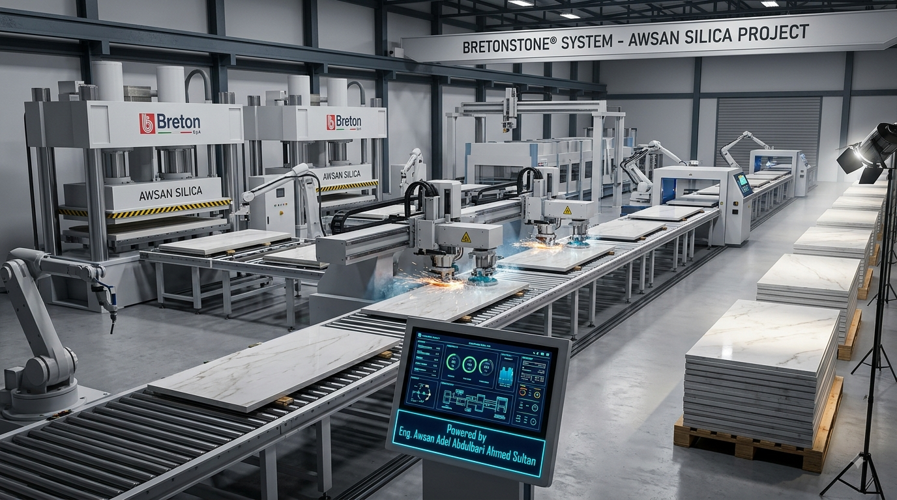

# 🤝 AWSAN SILICA: International Strategic Partners & Technical Specs

---

  

---

  

---

  

---

This document details the roles, technical workflows, machinery requirements, and execution steps for each global strategic partner involved in the **AWSAN SILICA** project, managed by **Awsan Dew For Marketing Services**.

---

## 1️⃣ Eriez Magnetics (USA) — Phase 1: Magnetic Separation
* **Role:** High-Intensity Ore Decontamination (Iron & Titanium Removal).
* **Location Applied:** Primary Processing Hubs (Sana'a & Shabwah).

---

  

---

  

---

### ⚙️ Operational Steps & Workflow:
1. Raw silica sand with up to 0.5% iron impurity is fed onto a high-speed, durable conveyor belt.
2. The material passes beneath **Eriez Rare Earth Electromagnetic Drums (HGMS)** generating intense magnetic flux fields.
3. Paramagnetic impurities (Iron oxides, Titanium, and Chromite mica) are attracted upward against gravity and separated into a discharge chute.
4. Pure snow-white silica sand continues along the main line toward the grinding sector.

### 📋 Infrastructure Requirements:
* High-Intensity Wet/Dry Magnetic Separators.
* Continuous heavy-duty conveyor systems.
* Integrated digital control panels for magnetic field auto-tuning.

---

## 2️⃣ Metso Outotec (Finland) — Phase 2: Grinding & Froth Flotation
* **Role:** Fine Pulverization and Micro-Impurity Chemical Isolation.
* **Location Applied:** Industrial Refining Plants (Ain Sokhna & Main Coastal Hubs).

---

  

---

  

---

### ⚙️ Operational Steps & Workflow:
1. Refined sand is transferred into **Metso Vertical Grinding Mills (VTM)** to achieve uniform micro-grain distribution without iron contamination.
2. The pulverized powder enters massive, interconnected **Metso Froth Flotation Cells (Tanks)** mixed with water and eco-friendly frothing agents.
3. Micro-bubbles attach selectively to feldspar and mica particles, causing them to float to the surface as foam.
4. Automatic skimmers remove the waste foam, leaving heavy, high-purity quartz slurry at the bottom of the tank.

### 📋 Infrastructure Requirements:
* Low-wear vertical grinding mills with ceramic/quartz linings.
* Automated flotation tank arrays with precise chemical dosing pumps.
* Advanced industrial slurry dehydrators.

---

## 3️⃣ TOMRA Mining (Norway/Germany) — Phase 3: Laser Optical Sorting
* **Role:** Mid-Air High-Precision Optical Purification (99.4%+ Purity Assurance).
* **Location Applied:** Advanced Finishing Lines (Sana'a & Socotra Eco-Line).

---

  

---

  

---

### ⚙️ Operational Steps & Workflow:
1. Dried quartz grains are dropped through a vertical gravity-fed feeding chute at high velocity.
2. Dual-channel **TOMRA Laser Sensors and Color High-Definition Cameras** scan every falling grain in mid-air within milliseconds.
3. Advanced AI algorithms detect discolored, opaque, or non-quartz particles based on optical transparency.
4. High-speed pneumatic valves shoot targeted micro-puffs of compressed air to deflect bad grains into a reject bin, while pristine crystals fall straight into the cleanroom container.

### 📋 Infrastructure Requirements:
* TOMRA PRO Secondary Laser Sorter units.
* High-volume industrial air compressors with moisture filtration.
* Fiber-optic real-time purity monitoring dashboards.

---

## 4️⃣ Breton S.p.A (Italy) — Phase 4: Luxury Finished Product Manufacturing
* **Role:** High-Value Transformation (Engineered Polished Quartz Slabs).
* **Location Applied:** Main Manufacturing Facility (Ain Sokhna Mega-Complex).

---

  

---

  

---

### ⚙️ Operational Steps & Workflow:
1. Ultra-pure quartz powder from previous stages is blended with high-grade organic resins and color pigments.
2. The mixture is distributed into large molds and processed using **Breton Vacuum-Vibro-Compression Presses** to eliminate all internal micro-air pockets.
3. The molded sheets undergo thermal curing in computerized ovens to reach maximum industrial hardness.
4. Multichannel robotic polishing lines equipped with diamond abrasives buff the slabs into a mirror-like, flawless finish.

### 📋 Infrastructure Requirements:
* Patented BretonStone® automated compaction press lines.
* Multi-head automated calibration and diamond polishing machinery.
* Robotic slab-handling, quality inspection, and export packaging systems.

---
*Disclaimer: All engineering diagrams, equipment models, and partner blueprints hosted within this repository are legally protected under the proprietary intellectual rights of Eng. Awsan Adel and Awsan Dew For
Marketing Services.*

---

# 🤝 سيليكا أوسان: الشركاء الاستراتيجيون الدوليون والمواصفات الفنية (AWSAN SILICA)

---

  

---

  

---

  

---

يوضح هذا المستند بالتفصيل الأدوار، ومخططات العمل الفنية، ومتطلبات المعدات، وخطوات التنفيذ لكل شريك استراتيجي عالمي مشارك في مشروع **AWSAN SILICA**، تحت إدارة وإشراف **مؤسسة أوسان دو لخدمات التسويق**.

---

## 1️⃣ شركة إيريز مغناطيس (Eriez Magnetics - الولايات المتحدة) — المرحلة 1: الفصل المغناطيسي
* **الدور الفني:** إزالة التلوث المعدني عالي الكثافة (فصل جزيئات الحديد والتيتانيوم).
* **أماكن التطبيق:** محطات المعالجة الأولية والمناجم (محافظة صنعاء ومحافظة شبوة).
---

  

---

  

---

### ⚙️ خطوات التشغيل ومخطط العمل:
1. يتم تغذية السيور الناقلة برمال السيليكا الخام التي تحتوي على شوائب حديدية تصل إلى 0.5%.
2. يمر الخام أسفل **أسطوانات كهرومغناطيسية عملاقة من الأرض النادرة (HGMS)** من تصنيع شركة Eriez، والتي تولد مجالات مغناطيسية جبارة.
3. يتم سحب الشوائب المغناطيسية (أكاسيد الحديد، التيتانيوم، والميكا الكرومية) إلى الأعلى عكس اتجاه الجاذبية وتصريفها في قناة عزل خاصة.
4. تتابع رمال السيليكا البيضاء الناصعة طريقها على السير الرئيسي نحو قطاع الطحن والتنعيم.

### 📋 متطلبات البنية التحتية والمعدات:
* أجهزة فصل مغناطيسي عالية الكثافة (أنظمة جافة ورطبة).
* سيور ناقلة متينة ومخصصة للأحمال الثقيلة والمستمرة.
* لوحات تحكم رقمية مدمجة للضبط التلقائي لقوة المجال المغناطيسي.

---

## 2️⃣ شركة ميتسو أوتوتيك (Metso Outotec - فنلندا) — المرحلة 2: الطحن والتعويم الرغوي
* **الدور الفني:** الطحن فائق النعومة والعزل الكيميائي للشوائب الدقيقة مجهرياً.
* **أماكن التطبيق:** مصانع التكرير المتقدمة (منطقة العين السخنة والمحطات الساحلية الرئيسية).

---

  

---

  

---

1. يتم نقل الرمل المفرز مغناطيسياً إلى **مطاحن ميتسو العمودية المتقدمة (VTM)** لطحن الخام والوصول إلى حجم حبيبات ميكروني متجانس دون التسبب في أي تلوث حديدي (باستخدام بطانات سيراميكية).
2. تدفق البودرة المطحونة إلى صهاريج ضخمة ومتصلة تُعرف بـ **خلايا التعويم الرغوي (Metso Flotation Cells)** حيث تُخلط بالماء ومواد رغوية متخصصة صديقة للبيئة.
3. تلتصق الفقاعات المجهرية بشكل انتقائي بجزيئات "الفلدسبار" و"الميكا"، مما يؤدي إلى طفوها على السطح كطبقة رغوية كثيفة.
4. تقوم كاشطات آلية بإزالة الرغوة الملوثة، بينما تترسب بودرة الكوارتز عالية النقاء والتركيز في قاع الصهريج.

### 📋 متطلبات البنية التحتية والمعدات:
* مطاحن عمودية منخفضة التآكل مبطنة بالسيراميك أو الكوارتز.
* مصفوفة صهاريج تعويم آلي بالكامل مع مضخات حقن كيميائي دقيقة.
* مجففات صناعية متطورة لتجفيف عجينة السيليكا النقية.

---

## 3️⃣ شركة تومرا للتعدين (TOMRA Mining - النرويج/ألمانيا) — المرحلة 3: الفرز البصري بالليزر
* **الدور الفني:** التنقية البصرية عالية الدقة في الهواء (ضمان نقاء يتجاوز 99.4%).
* **أماكن التطبيق:** خطوط الإنتاج والإنهاء المتقدمة (محافظة صنعاء والخط البيئي المعزول في سقطرى).

---

  

---

  

---

### ⚙️ خطوات التشغيل ومخطط العمل:
1. تسقط حبيبات الكوارتز المجففة عمودياً وبسرعة عالية عبر مجرى تغذية يعتمد على الجاذبية.
2. تقوم **مستشعرات ليزر تومرا وكاميرات الفحص الرقمية عالي الدقة ثنائية القناة** بمسح وفحص كل حبة رمل تسقط في الهواء خلال أجزاء من الملي ثانية.
3. تتعرف خوارزميات الذكاء الاصطناعي المدمجة على الحبيبات الملونة، أو المعتمة، أو الشوائب غير الكوارتزية بناءً على درجة الشفافية ونفاذ الضوء.
4. تطلق صمامات هوائية فائقة السرعة **نفاثات مضغوطة من الهواء (Compressed air jets)** بدقة متناهية لنفث وطرد الحبيبات المعيبة جانباً إلى حاوية المخلفات، بينما تسقط البلورات الشفافة تماماً مباشرة إلى حاوية النقاء النهائي.

### 📋 متطلبات البنية التحتية والمعدات:
* وحدات الفرز بالليزر الثانوية (TOMRA PRO Secondary Laser Sorter).
* ضواغط هواء صناعية ضخمة مجهزة بفلاتر متطورة لعزل الرطوبة والزيوت.
* شاشات تحكم رقمية لمراقبة نسب النقاء الفعلي عبر الألياف البصرية.

---

## 4️⃣ شركة بريتون (Breton S.p.A - إيطاليا) — المرحلة 4: تصنيع المنتجات الفاخرة النهائية
* **الدور الفني:** تحويل الخام إلى منتجات نهائية ذات قيمة اقتصادية مضاعفة (ألواح الكوارتز المصقولة).
* **أماكن التطبيق:** منشأة التصنيع والإنتاج النهائي المتكاملة (مجمع العين السخنة العملاق).

---

  

---

  

---

### ⚙️ خطوات التشغيل ومخطط العمل:
1. يتم أخذ مسحوق الكوارتز فائق النقاء وتلقيمه داخل خلاطات آلية لمزجه بنسب دقيقة من راتنجات الألياف العضوية والأصباغ اللونية الفاخرة.
2. يتم توزيع المزيج داخل قوالب ضخمة، ثم يدخل إلى **مكابس Breton للضغط والاهتزاز تحت تفريغ الهواء (Vacuum-Vibro-Compression)** للتخلص تماماً من أي فقاعات هواء مجهرية داخلية.
3. تدخل الألواح المشكلة إلى أفران تجفيف يتم التحكم بها برمجياً للوصول بالمنتج إلى أقصى درجات الصلابة الصناعية ومقاومة الخدش.
4. تمر الألواح عبر خطوط صقل وتلميع روبوتية متعددة الرؤوس ومجهزة بأقراص ألماسية، لتحويل الألواح إلى أسطح مرآتية لامعة وشديدة الفخامة.

### 📋 متطلبات البنية التحتية والمعدات:
* خطوط مكابس الكبس والاهتزاز المسجلة ببراءة اختراع (BretonStone®).
* ماكينات معايرة وتلميع آلي متعددة الرؤوس بأقراص الألماس.
* أنظمة روبوتية لمناولة الألواح، فحص الجودة بالذكاء الاصطناعي، والتغليف الجاهز للتصدير الدولي.

---
*إخلاء مسؤولية: جميع المخططات الهندسية، وموديلات المعدات، ومخططات الشركاء المستضافة داخل هذا المستودع محمية قانونياً بموجب حقوق الملكية الفكرية وحقوق الطبع الاستثمارية الخاصة بالمهندس/ أوسان عادل ومؤسسة أوسان دو لخدمات التسويق.*

