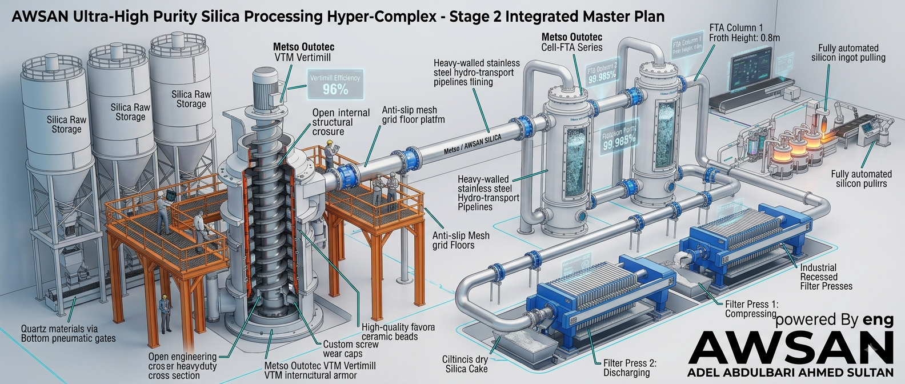
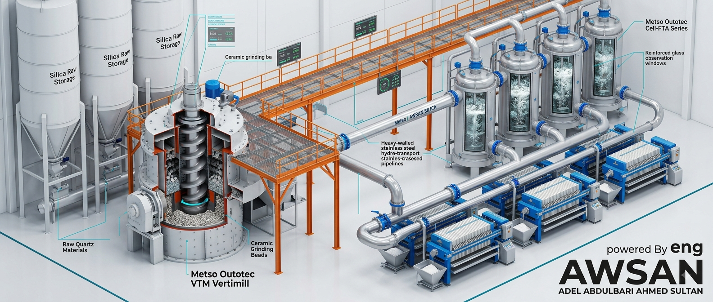
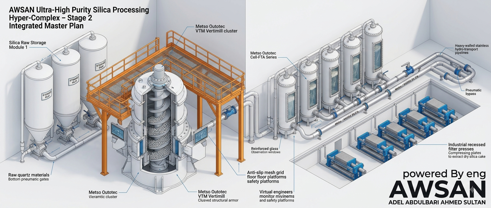
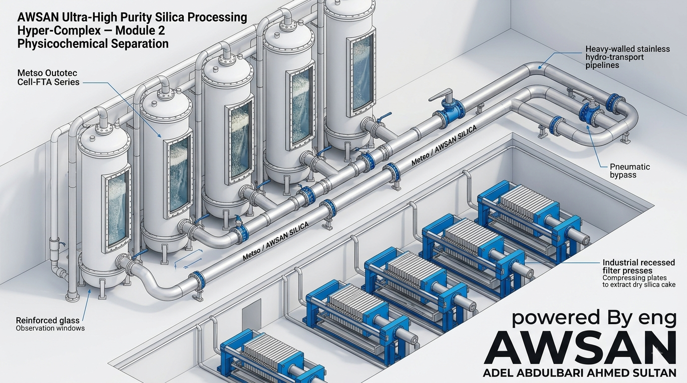
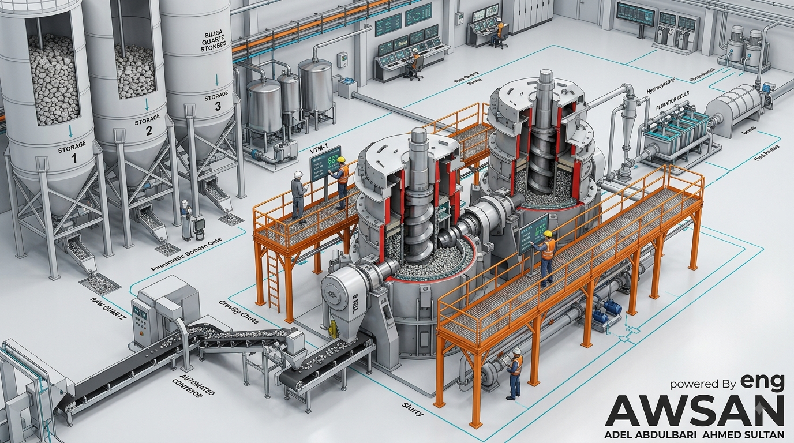
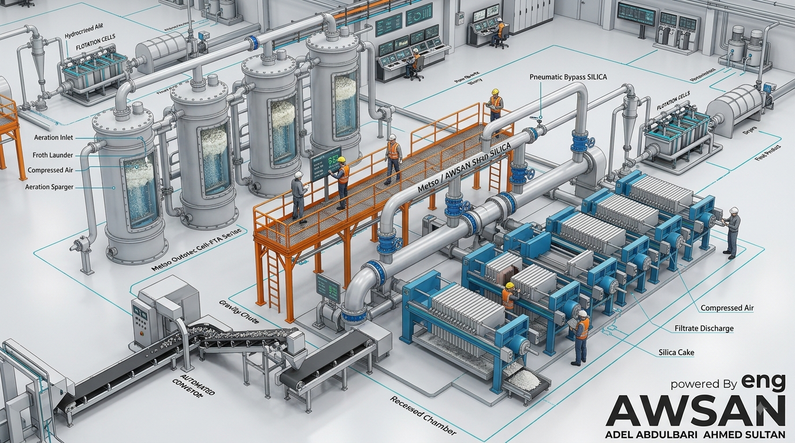
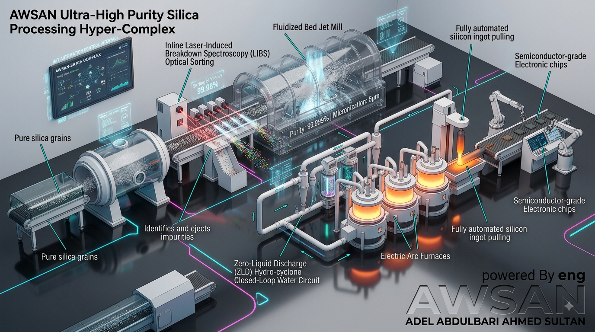
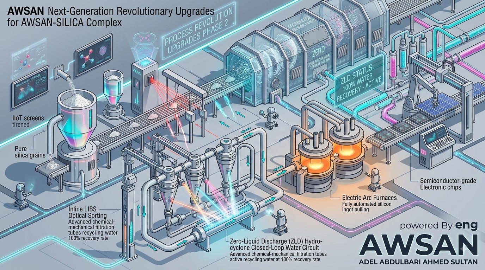
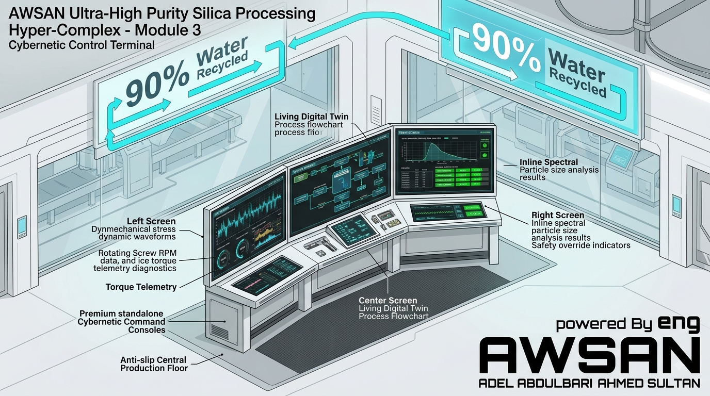
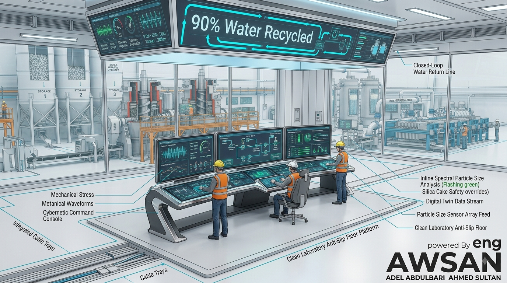

# 🌍 AWSAN SILICA: Strategic Quartz & Silica Sand Mining Project in Yemen


<p align="center">
  
</p>

---

<p align="center">
  
</p>


---

<p align="center">
  
</p>

---

<p align="center">
  
</p>

---

<p align="center">
  
</p>

---

Welcome to **AWSAN SILICA**, a comprehensive strategic blueprint and geological survey mapping the massive, untapped high-purity quartz (HPQ) and silica sand deposits across the Republic of Yemen and its strategic islands.

Yemen holds an estimated **2 Billion cubic meters** of high-purity silica sandstone (up to **99.4% purity**) and over **13 Million cubic meters** of pure quartz vein crystalline deposits. This repository serves as an industrial development hub for feasibility studies, processing workflows, and international investment frameworks.

---

## 🗺️ Geological Mapping & Key Deposits in Yemen

### 1. Central & North Region (Silica Sand & Glass Raw Material)
*   **Sana'a Governorate (Thagban, Tawzan, & Al-Arisha):** Located northwest of the capital. It hosts massive sedimentary reserves of highly pure glass-grade silica with minimal iron contamination.
*   **Al-Mahwit Governorate (Al-Tawilah Geological Group):** Characterized by thick, exposed layers of friable, premium-grade white sandstone with exceptionally high silica density.

### 2. North-West & Eastern Block (Quartz Veins & Sedimentary Reserves)
*   **Hajjah Governorate (Haradh & Bakil Al-Mir):** Pure quartz occurs as rich veins and lenses embedded in pegmatite and schist rocks, boasting a silica ratio of **97.8%**.
*   **Sa'dah Governorate (Al-Manzalah & Jabal Awaydiah):** Belongs to the famous "Kohlan Sandstone formation" containing extensive deposits of clean quartz rock.
*   **Shabwah & Hadramout Governorates (Wajid Formation):** Features immense Paleozoic sandstone fields with thick, unburdened layers, uniform grain distribution, and ultra-low mineral impurities.

### 3. Socotra Archipelago Region (Eco-Grade Ultra-Pure White Sand Dunes)
*   **Socotra Island (Zaheq & Arher Massive Sand Dunes):** Characterized by a highly unique, globally isolated geological topography. It treasures towering white sand dunes of exceptional natural purity, formed by seasonal monsoon winds and limestone-granite weathering. These reserves are highly suitable for advanced optical glass and micro-electronics, operating under strict ecological sustainability standards to fully protect the island's UNESCO biosphere and Dragon's Blood trees.

---


<p align="center">
  
  
</p>

---


<p align="center">
  
  
</p>

---


<p align="center">
  
  
</p>

---


<p align="center">
  
  
</p>

---


<p align="center">
  
  
</p>


---

## 🏗️ Project Architecture & Processing Pipeline

The **AWSAN SILICA** industrial ecosystem is designed on a 3-tier value chain to maximize local economic impact and support global high-tech supply chains:

*   **Step 1: Extraction & Mines**
    *   Sustainable site infrastructure and open-pit mining development.
    *   Eco-friendly sourcing methods (strictly applied to protect Socotra's environment).
    *   Optimized maritime and land logistics connecting fields to major refining hubs.

*   **Step 2: Beneficiation Plant**
    *   High-Intensity Magnetic Separation (to eliminate iron and titanium oxides).
    *   Zero-pollution Chemical Froth Flotation (to remove feldspar and mica flakes).
    *   Advanced Automated Optical Sorting via ultra-fast laser cameras and pneumatic air-jets.

*   **Step 3: High-Tech Value Output**
    *   High-transparency Solar Photovoltaic Glass (Purity 99.5%).
    *   Ultra-Pure Semiconductors and Microchips (Purity 4N+).
    *   Premium Polished Quartz Slabs for luxury architecture and medical surfaces.

---

## 📊 Economic Viability & Value Addition (The Multiplication Formula)

Currently, raw silica sand is sold or exported at low commodity prices (approx. **$15 - $25 per Ton**). By building the **AWSAN SILICA Refining Hub**, the processing shifts the value chain exponentially for **Awsan Dew For Marketing Services**:

| Material Form | Processing Level | Estimated Market Value (per Ton) | Target Industry |
| :--- | :--- | :--- | :--- |
| **Raw White Sand** | Raw Extraction & Crushing | $15 - $25 | Construction, Basic Foundry |
| **Purified Silica Powder** | Magnetic + Flotation Refining | $150 - $350 | Premium Micro-glass, Optical Fibers |
| **High-Purity Quartz (HPQ)** | Thermal Shock + Acid Leaching | $3,000 - $8,000+ | Solar Photovoltaic, Semiconductors |
| **Polished Quartz Slabs** | Casting & Mold Manufacturing | $2,000 - $5,000 | Luxury Architecture, Medical Surfaces |

---

## 📁 Repository Directory Structure

```backcountry
AWSAN-SILICA/
│
├── 📂 assets/                     # Project visual assets, diagrams, and media branding
│
├── 📂 engineering_specs/          # 🏗️ Blueprints and technical specifications for production & refining lines
│   ├── bretonstone_automated_line_specs.md # Technical specifications for Breton automated quartz slab lines
│   ├── bretonstone_export_crating_specs.md # Standardized packaging and export crating criteria for Breton systems
│   ├── bretonstone_finishing_station_specs.md # Specifications for quartz slab polishing and finishing stations
│   ├── metso_integrated_panoramic_specs.md # Panoramic operational integrated specs for Metso processing systems
│   ├── metso_outotec_flotation_specs.md  # Engineering specs for Metso Outotec froth flotation cell matrices
│   ├── metso_vlm_cross_section_specs.md # Cross-sectional blueprints for Metso ceramic-lined vertical mills
│   ├── metso_vlm_flotation_specs.md     # Flotation integration and parameters for Metso vertical milling
│   ├── milling_and_flotation_master.md  # Master engineering document for vertical milling & froth flotation
│   ├── milling_flotation_stage2.md      # Detailed specs for the secondary stage milling and flotation line
│   ├── refining_pipeline_final.md       # Final chemical purification and refining pipeline flow design
│   ├── refining_pipeline_v1.md          # Preliminary architecture for the refining and processing pipeline
│   ├── tomra_chute_sorting_specs.md     # Engineering specs for TOMRA gravity-fed chute sorting systems
│   ├── tomra_cleanroom_laser_specs.md   # Laser sorting infrastructure for high-purity cleanroom environments
│   ├── tomra_laser_and_breton_specs.md  # Interfacing specs between TOMRA sensors and Breton compaction lines
│   └── tomra_pro_secondary_sorting_specs.md # Advanced specifications for TOMRA secondary high-grade sorting units
│
├── 📂 financial_models/           # 🔒 CRITICAL: Main Proprietary Financial & Investment Hub (Protected by .gitignore)
│   │
│   ├── 📂 corporate_letters/             # ✉️ Official Letters of Intent (LOIs) to Global Partners
│   │   ├── LOI_Dorfner_Anzaplan.txt       # Sample processing & chemical purification evaluation (Germany)
│   │   ├── LOI_TOMRA_Mining.txt           # Mid-air sensor-based laser sorting infrastructure (Germany/Norway)
│   │   ├── LOI_Breton_Spa.txt             # Patented BretonStone® luxury quartz slab compaction line (Italy)
│   │   ├── LOI_Metso_Outotec.txt          # Ceramic-lined vertical milling & froth flotation cells (Finland)
│   │   ├── LOI_Eriez_Magnetics.txt        # High-intensity rare earth electromagnetic drum matrices (USA)
│   │   └── LOI_SRK_Consulting.txt         # Bankable Feasibility Study (BFS) & JORC resource certification (UK)
│   │
│   ├── 📂 feasibility_studies/           # 📊 Bankable Feasibility Studies & Valuation Projections
│   │   ├── financial_assumptions.json     # Dynamic system configurations (Exchange rates, inflation indices, discount rates)
│   │   └── summary_feasibility_2026.md    # Executive financial summary and project scope (Bilingual)
│   │
│   ├── 📂 capex_opex_sheets/              # 📈 Spreadsheet Modeling, Automation Scripts & Cost Analysis
│   │   ├── awsan_silica_app.py            # Streamlit/Dash core application script for interactive financial modeling
│   │   ├── generate_capex_sheet.py        # Python script to calculate and export Capital Expenditure datasets
│   │   ├── generate_opex_sheet.py         # Python script to automate and simulate Operational Expenditure frameworks
│   │   ├── generate_revenue_model.py      # Python routine for generating revenue projection matrix and cash flows
│   │   ├── revenue_projection_model.py    # Algorithmic pricing models and long-term asset valuation logic
│   │   └── spreadsheet_modeling_master.md # 📄 Documentation guide for internal financial engines and excel templates
│   │
│   ├── 📂 investor_pitch/                 # 💼 Venture Capitalist & Sovereign Wealth Fund Pitch Decks
│   │   ├── investment_phases_timeline.md  # Multi-tier equity sharing structures and funding horizon checkpoints
│   │   └── prospectus_awsan_silica.md     # 📄 Official preliminary private placement memorandum & investor prospectus
│   │
│   └── 📄 feasibility_study_2026.md       # 📑 Central comprehensive project evaluation report and baseline financial metrics
│
├── 📂 geological_data/            # Raw surveys, GIS shapefiles, and purity lab results
│   ├── mahwit_tawilah.json            # Purity and geological data for Al-Mahwit (At-Tawilah)
│   ├── sanaa_thagban.json             # High-purity silica sand data for Sana'a (Thagban field)
│   ├── socotra_arher.json             # Quartz sand survey for Socotra (Arher beach/dunes)
│   └── yemen_field_report_2026.md     # 📄 Comprehensive field investigation report and analytical findings (2026)
│
├── PARTNERS_AND_SPECS.md          # Partnership conditions and technical standards details
├── PLANTS_AND_SYSTEMS_MASTER.md   # Master file for processing plants and infrastructure systems
├── SMART_STORAGE_AND_SOLAR.md     # Strategy and specs for smart storage facilities and solar power utilities
├── SPACES_AND_STRATEGY.md         # Spatial allocation and macro-economic operational strategies
├── .gitignore                     # Specifies intentionally untracked files to ignore
├── LICENSE                        # Proprietary Ownership and Rights Reserved File
└── README.md                      # Main Project Overview and Strategic Vision
```


---

## 🔒 Proprietary Ownership Notice
This project, including all technical, geological, economic, and programmatic contents, is the exclusive intellectual property of **Eng. Awsan Adel Abdulbari Ahmed Sultan** and **Awsan Dew For Marketing Services** (Republic of Yemen). All rights are strictly reserved. Unauthorized duplication, presentation, or commercial usage is legally prohibited.

---

# 🌍 سيليكا أوسان AWSAN SILICA: المشروع الاستراتيجي لتعدين الكوارتز ورمال السيليكا في اليمن (AWSAN SILICA)

<p align="center">
  
</p>

---

<p align="center">
  
</p>


---

<p align="center">
  
</p>

---

<p align="center">
  
</p>

---

<p align="center">
  
</p>

---


أهلاً بكم في **سيليكا أوسان (AWSAN SILICA)**، المخطط الاستراتيجي الشامل والمسح الجيولوجي المتكامل لخرائط رواسب الكوارتز فائق النقاء (HPQ) ورمال السيليكا البكر وغير المستغلة في أراضي الجمهورية اليمنية وجزرها الحيوية.

تمتلك اليمن احتياطيات هائلة تُقدر بنحو **2 مليار متر مكعب** من الحجر الرملي السيليسي عالي النقاء (تصل نسبة النقاوة فيه إلى **99.4%**)، وأكثر من **13 مليون متر مكعب** من رواسب عروق الكوارتز البلورية النخبة. يمثل هذا المستودع مركزاً لتطوير دراسات الجدوى، ومخططات المعالجة الصناعية، وأطر الاستثمار التعديني.

---

## 🗺️ الخارطة الجغرافية والمواقع التعدينية الرئيسية في اليمن

### 1. الإقليم الأوسط والشمالي (رمال السيليكا والمواد الخام لصناعة الزجاج)
*   **محافظة صنعاء (منطقة ثقبان، طوظان، والعريشة):** تقع شمال غرب العاصمة. وتحتوي على احتياطيات رسوبية ضخمة من السيليكا النقية الصالحة لصناعة الزجاج الفاخر مع حد أدنى من شوائب الحديد.
*   **محافظة المحويت (مجموعة الطويلة الجيولوجية):** تتميز بطبقات سميكة ومكشوفة من الحجر الرملي الأبيض اللين ذي النقاء والتركيز الاستثنائي للسيليكا.

### 2. الإقليم الشمالي الغربي والكتلة الشرقية (عروق الكوارتز والاحتياطيات الرسوبية)
*   **محافظة حجة (حرض وبكيل المير):** يتواجد الكوارتز النقي على هيئة عروق وعدسات غنية داخل صخور البيغماتيت والشست، بنسبة سيليكا تصل إلى **97.8%**.
*   **محافظة صعدة (المنزالة وجبل عويدية):** تتبع تكوين "كحلان" الرملي الشهير وتضم رواسب ممتدة من صخور الكوارتز النظيفة.
*   **محافظتا شبوة وحضرموت (تكوين وجيد):** تمتاز بحقول شاسعة من الحجر الرملي تعود للعصر الباليوزوي، وتتميز بطبقات سميكة جداً وتوزيع حبيبي متجانس وشبه خالية من الشوائب المعدنية.

### 3. إقليم أرخبيل سقطرى (الكثبان الرملية البيضاء فائقة النقاء البيئي)
*   **جزيرة سقطرى (كثبان  عرهر أرشر وزاهق الرملية الشاهقة):** تتميز بطبوغرافية فريدة ومعزولة جيولوجياً، حيث تكتنز كثباناً رملية بيضاء شاهقة وممتدة ذات نقاء طبيعي استثنائي تشكلت بفعل الرياح الموسمية وعوامل التجوية للحجر الجيري والجرانيت، وهي صالحة للتطبيقات الإلكترونية الدقيقة والزجاج البصري مع الالتزام التام بمعايير الاستدامة البيئية لحماية محميات الجزيرة الطبيعية وأشجار دم الأخوين.

---


<p align="center">
  
  
</p>

---


<p align="center">
  
  
</p>

---


<p align="center">
  
  
</p>


---


<p align="center">
  
  
</p>

---


<p align="center">
  
  
</p>

---

## 🏗️ الهيكل الصناعي ومراحل تكرير ومعالجة السيليكا

تم تصميم النظام البيئي الصناعي لمشروع **AWSAN SILICA** بناءً على سلسلة قيمة ثلاثية المستويات لتعظيم العائد الاقتصادي المحلي ودعم سلاسل إمداد التكنولوجيا العالمية:

*   **الخطوة 1: الاستخراج والمناجم**
    *   تجهيز البنية التحتية للمواقع والمناجم المكشوفة.
    *   التعدين السطحي المستدام (مع تطبيق معايير بيئية صارمة وصديقة للبيئة في سقطرى).
    *   الخدمات اللوجستية ونقل الخام للمراكز الرئيسية عبر خطوط الشحن البحري والبري.

*   **الخطوة 2: مصنع التركيز والتكرير**
    *   الفصل المغناطيسي عالي الكثافة (لإزالة الحديد والتيتانيوم).
    *   التعويم الرغوي الكيميائي الخالي من الملوثات (لإزالة الفلدسبار والميكا).
    *   الفصل البصري المتقدم بكاميرات الليزر فائقة السرعة ونفاثات الهواء المضغوط.

*   **الخطوة 3: المنتج النهائي فائق التكنولوجيا**
    *   زجاج الألواح الشمسية عالي الشفافية (نقاء 99.5%).
    *   أشباه الموصلات والرقائق الإلكترونية فائقة النقاء (نقاء 4N+).
    *   ألواح الكوارتز المصقولة الفاخرة للإنشاءات الهندسية والمستشفيات.

---

## 📊 الجدوى الاقتصادية ومعادلة تضاعف القيمة المضافة

حالياً، يتم بيع أو تصدير رمال السيليكا الخام بأسعار منخفضة جداً كمادة أولية (حوالي **15 إلى 25 دولاراً للطن**). ومن خلال بناء **مركز تكرير سيليكا أوسان**، تقفز سلسلة القيمة بشكل مضاعف لصالح **مؤسسة أوسان دو لخدمات التسويق**:

| شكل المادة الخام | مستوى المعالجة والتكرير | القيمة السوقية التقديرية (لكل طن) | الصناعة المستهدفة |
| :--- | :--- | :--- | :--- |
| **الرمل الأبيض الخام** | استخراج وتكسير أولي | $15 - $25 | البناء، المسبوكات التقليدية |
| **مسحوق السيليكا المكرر** | معالجة مغناطيسية + تعويم | $150 - $350 | الزجاج الدقيق الفاخر، البصريات |
| **الكوارتز فائق النقاء (HPQ)** | صدمة حرارية + غسيل حمضي | $3,000 - $8,000+ | الخلايا الشمسية، أشباه الموصلات |
| **ألواح الكوارتز المصقولة** | صب وتصنيع قوالب جاهزة | $2,000 - $5,000 | العمارة الفاخرة، الأسطح الطبية |

---
## 📁 البنية الهيكلية للمستودع (Repository Directory Structure)

```backcountry
AWSAN-SILICA/
│
├── 📂 assets/                     # الأصول المرئية للمشروع، الرسوم البيانية، والهوية الإعلامية للعلامة التجارية
│
├── 📂 engineering_specs/          # 🏗️ المخططات الهندسية والمواصفات الفنية لخطوط الإنتاج والتكرير
│   ├── bretonstone_automated_line_specs.md # مواصفات خط الإنتاج الآلي لألواح الكوارتز من شركة بريتون
│   ├── bretonstone_export_crating_specs.md # معايير التغليف وتعبئة الصناديق الخاصة بالتصدير لمنتجات بريتون
│   ├── bretonstone_finishing_station_specs.md # مواصفات محطة التشطيب النهائي والصقل لألواح الكوارتز
│   ├── metso_integrated_panoramic_specs.md # المواصفات البانورامية المتكاملة لأنظمة المعالجة من شركة ميتسو
│   ├── metso_outotec_flotation_specs.md  # المواصفات الفنية لخلايا تعويم الرغوة من شركة ميتسو أوتوتيك
│   ├── metso_vlm_cross_section_specs.md # مواصفات المقاطع العرضية لطواحين ميتسو العمودية المبطنة بالسيراميك
│   ├── metso_vlm_flotation_specs.md     # التكامل التشغيلي بين طواحين ميتسو العمودية وخلايا التعويم
│   ├── milling_and_flotation_master.md  # الدليل الرئيسي لعمليات الطحن الرأسي وتعويم الرغوة للسيليكا
│   ├── milling_flotation_stage2.md      # المواصفات الفنية للمرحلة الثانية من خطوط الطحن والتعويم
│   ├── refining_pipeline_final.md       # المخطط والتدفق النهائي لخط أنابيب التكرير والمعالجة الكيميائية
│   ├── refining_pipeline_v1.md          # النسخة الأولى من مخطط خط أنابيب التكرير والمعالجة
│   ├── tomra_chute_sorting_specs.md     # مواصفات أجهزة الفرز القائمة على مجاري الانزلاق من شركة تومرا
│   ├── tomra_cleanroom_laser_specs.md   # مواصفات الفرز بالليزر داخل الغرف النظيفة لضمان أعلى نقاء
│   ├── tomra_laser_and_breton_specs.md  # شروط الربط الفني والتكاملي بين مستشعرات تومرا وخطوط كبس بريتون
│   └── tomra_pro_secondary_sorting_specs.md # مواصفات أنظمة الفرز الثانوي المتقدمة لرفع جودة المنتج النهائي
│
├── 📂 financial_models/           # 🔒 هام وحرج: المركز الرئيسي للبيانات المالية والاستثمارية المملوكة (محمي بواسطة gitignore.)
│   │
│   ├── 📂 corporate_letters/             # ✉️ خطابات النوايا الرسمية (LOIs) الموجهة للشركاء العالميين
│   │   ├── LOI_Dorfner_Anzaplan.txt       # تقييم معالجة العينات والتنقية الكيميائية (ألمانيا)
│   │   ├── LOI_TOMRA_Mining.txt           # بنية فرز الليزر المعتمدة على الاستشعار في الهواء (ألمانيا/النرويج)
│   │   ├── LOI_Breton_Spa.txt             # خط كبس ألواح الكوارتز الفاخرة الحاصل على براءة اختراع ®BretonStone (إيطاليا)
│   │   ├── LOI_Metso_Outotec.txt          # خلايا تعويم الرغوة والطحن الرأسي المبطن بالسيراميك (فنلندا)
│   │   ├── LOI_Eriez_Magnetics.txt        # مصفوفات الأسطوانات الكهرومغناطيسية للعناصر الأرضية النادرة عالية الكثافة (أمريكا)
│   │   └── LOI_SRK_Consulting.txt         # دراسة الجدوى البنكية (BFS) واعتماد موارد JORC (بريطانيا)
│   │
│   ├── 📂 feasibility_studies/           # 📊 دراسات الجدوى البنكية والتوقعات التقييمية للمشروع
│   │   ├── financial_assumptions.json     # إعدادات النظام الديناميكية (أسعار الصرف، مؤشرات التضخم، معدلات الخصم)
│   │   └── summary_feasibility_2026.md    # الملخص المالي التنفيذي ونطاق المشروع (ثنائي اللغة)
│   │
│   ├── 📂 capex_opex_sheets/              # 📈 نمذجة الجداول الحسابية، سكربتات الأتمتة، وتحليل التكاليف
│   │   ├── awsan_silica_app.py            # السكربت البرمجي الرئيسي لتطبيق Streamlit/Dash للنمذجة المالية التفاعلية
│   │   ├── generate_capex_sheet.py        # سكربت بايثون لحساب وتصدير بيانات النفقات الرأسمالية (CAPEX)
│   │   ├── generate_opex_sheet.py         # سكربت بايثون لأتمتة ومحاكاة أطر النفقات التشغيلية (OPEX)
│   │   ├── generate_revenue_model.py      # إجراء برميجي لتوليد مصفوفة توقعات الإيرادات والتدفقات النقدية
│   │   ├── revenue_projection_model.py    # خوارزميات نماذج التسعير ومنطق تقييم الأصول على المدى الطويل
│   │   └── spreadsheet_modeling_master.md # 📄 دليل التوثيق لمحركات النماذج المالية الداخلية وقوالب الإكسل
│   │
│   ├── 📂 investor_pitch/                 # 💼 العروض التقديمية الموجهة للمستثمرين الصناديق السيادية ورؤوس الأموال الاستثمارية
│   │   ├── investment_phases_timeline.md  # هياكل تقاسم الأسهم متعددة المستويات ومراحل التمويل المستهدفة
│   │   └── prospectus_awsan_silica.md     # 📄 مذكرة الطرح الخاص الأولي التمهيدي ونشرة المستثمر الرسمية
│   │
│   └── 📄 feasibility_study_2026.md       # 📑 تقرير تقييم المشروع الشامل والمركز والمقاييس المالية الأساسية
│
├── 📂 geological_data/            # المسوحات الخام، ملفات نظام المعلومات الجغرافي (GIS)، ونتائج مختبرات النقاء
│   ├── mahwit_tawilah.json            # بيانات النقاء والمسح الجيولوجي لمحافظة المحويت (منطقة الطويلة)
│   ├── sanaa_thagban.json             # بيانات رمل السيليكا عالي النقاء لمحافظة صنعاء (حقل ثقبان)
│   ├── socotra_arher.json             # مسح رمل الكوارتز لجزيرة سقطرى (منطقة أرخر)
│   └── yemen_field_report_2026.md     # 📄 تقرير التحقيق الميداني الشامل والنتائج التحليلية لعام 2026
│
├── PARTNERS_AND_SPECS.md          # تفاصيل شروط الشراكة والمعايير الفنية والتقنية
├── PLANTS_AND_SYSTEMS_MASTER.md   # الملف الرئيسي للمصانع الإنتاجية وأنظمة البنية التحتية
├── SMART_STORAGE_AND_SOLAR.md     # استراتيجية ومواصفات مرافق التخزين الذكية ومرافق الطاقة الشمسية
├── SPACES_AND_STRATEGY.md         # Spatial allocation and macro-economic operational strategies
├── .gitignore                     # لتحديد الملفات والمجلدات غير المتتبعة التي يتم تجاهلها عمداً
├── LICENSE                        # ملف الملكية الفكرية الخاص وحفظ الحقوق
└── README.md                      # النظرة العامة الرئيسية للمشروع والرؤية الاستراتيجية
```


---

## 🔒 إشعار الملكية الفكرية وحفظ الحقوق
هذا المشروع بكافة محتوياته الفنية، والجيولوجية، والاقتصادية، والبرمجية، يعتبر ملكية فكرية حصرية وخاصة بـ **المهندس/ أوسان عادل عبدالباري أحمد سلطان** و**مؤسسة أوسان دو لخدمات التسويق** (الجمهورية اليمنية). جميع الحقوق محفوظة بشكل صارم، ويُمنع منعاً باتاً نسخها، أو استخدامها تجارياً، أو عرضها دون إذن خطي وموثق من مالك المشروع.

---


---

