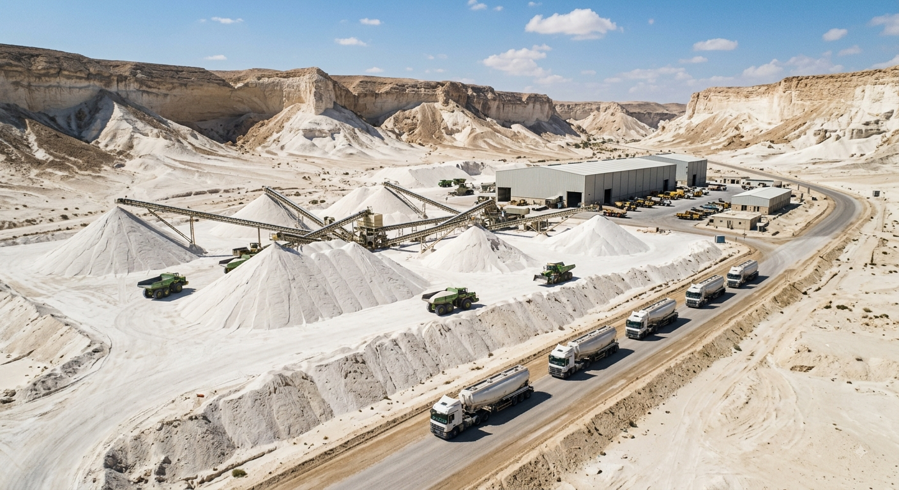
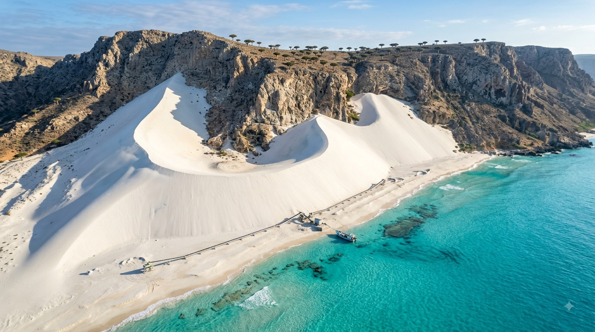
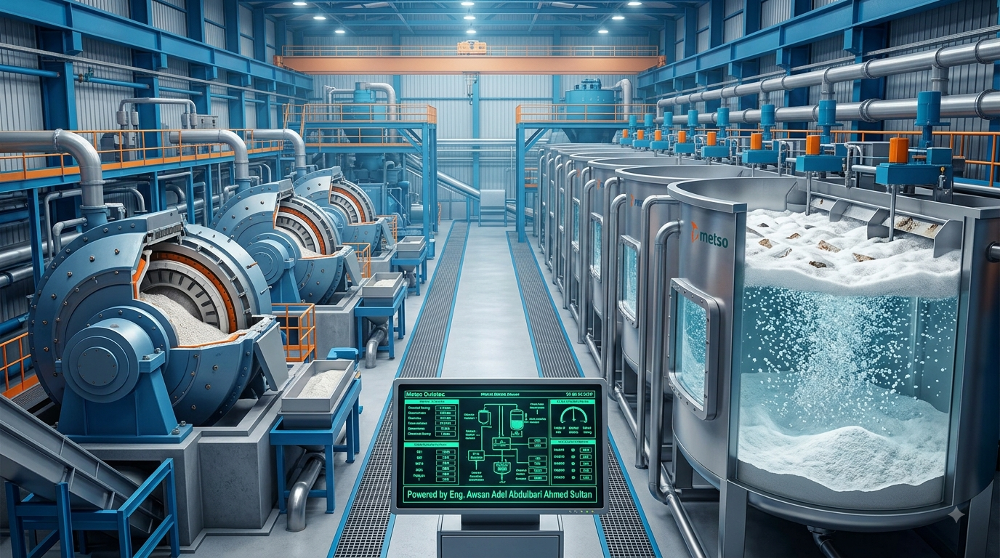

# 📊 AWSAN SILICA: Strategic Space Allocation & Operational Strategy Roadmap

This document outlines the geographical and industrial space allocations, inner zoning configurations, and sequential operational strategies (Current vs. Future) designed to maximize the value chain for **Awsan Dew For Marketing Services** under the leadership of **Eng. Awsan Adel Abdulbari Ahmed Sultan**.

---

  

---

## 🗺️ 1. Geographical Space Allocation & Open-Pit Mining Sites

### 📍 A. Thagban, Tawzan, & Al-Arisha (Sana'a Governorate)

---

  

---

  

---

*   **Total Allocated Area:** **12 Square Kilometers** (Primary Mining & Exploration Concession).
*   **Inner Space Zoning Distribution:**
    *   **Open-Pit Quarry Zones (Mines):** 6 sq. km (Engineered with safe geological benching tiers).
    *   **Primary Crushing & Screening Station:** 200,000 sq. meters (Hosting industrial jaw crushers).
    *   **Logistics Yard & Raw Ore Stockpiles:** 150,000 sq. meters (For storing rock quartz before transport).
    *   **Field Offices, Engineering Base, & Staff Housing:** 50,000 sq. meters.
*   **Current Operational Plan (Years 1-2):** Opening quarry faces, isolating pure quartz veins, and operating primary Jaw Crushers to reduce raw rock to 10-50mm aggregate sizes, preparing it for shipment to the main refinery complex.
*   **Future Operational Plan (Years 3-5):** Sinking advanced underground mining shafts to tap into deeper, pristine ultra-pure quartz zones, and establishing a local mining academy to train and certify Yemeni geological and engineering cadres.

### 📍 B. Wajid Sandstone Fields (Shabwah & Hadramout Governorates)

---

  

---

  

---

*   **Total Allocated Area:** **35 Square Kilometers** (Expansive sedimentary fields due to thick sandstone layers).
*   **Inner Space Zoning Distribution:**
    *   **Automated Surface Scraping Sectors:** 25 sq. km (Segmented into rotating extraction grids).
    *   **Massive Logistics & Loading Terminals:** 5 sq. km (For stockpiling high-grade silica sand before coastal shipment).
    *   **Primary Sand Washing & Drying Plant:** 1.5 sq. km (Utilizing recycled water loop circuits to eliminate surface clay and silt).
    *   **Heavy Haulage Internal Road Network:** 3.5 sq. km (Dedicated exclusively to high-capacity industrial trucks).
*   **Current Operational Plan (Years 1-2):** Laying down heavy internal haulage access roads and launching open-pit surface mining at a target capacity of 500,000 Tons per Year, using the washing plant to export premium foundry and glass sand to regional and Gulf markets.
*   **Future Operational Plan (Years 3-5):** Full automation of sand harvesting using GPS-guided, satellite-linked heavy machinery to boost production to 2 Million Tons per Year, and constructing a continuous Wet Slurry Pipeline to pump refined sand directly from fields to the nearest shipping port, eliminating inland hauling costs.

### 📍 C. Ecological Isolated Zone - Arher & Zaheq Dunes (Socotra Archipelago)

---

  

---

  

---

*   **Total Allocated Area:** **1.5 Square Kilometers Only** (Strictly bounded and ecologically restricted buffer zone).
*   **Inner Space Zoning Distribution:**
    *   **Low-Impact Automated Sourcing Sector:** 500,000 sq. meters (Surface-only harvesting to prevent alterations to the pristine, towering dune topography).
    *   **Enclosed Eco-Friendly Electric Conveyor Corridors:** 2km length by 10-meter width path (Transporting sand directly to docking vessels, completely avoiding diesel-fueled trucks on the island).
    *   **Environmental Monitoring & Logistics Outpost:** 20,000 sq. meters (Constructed with local bio-architecture that blends into the landscape to guarantee full protection of the UNESCO biosphere and Dragon's Blood trees).
*   **Current Operational Plan (Years 1-2):** Initiating highly controlled surface harvesting capped strictly at 50,000 Tons per Year, relying 100% on solar-powered enclosed conveyors to maintain zero carbon emissions in the archipelago.
*   **Future Operational Plan (Years 3-5):** Upgrading the Socotra site into a globally certified "Green-Mining Hub" benchmark, and allocating a dedicated percentage of Socotra quartz revenues to finance local marine and terrestrial biodiversity conservation projects as part of your company's social responsibility.

---

## 🏭 2. Industrial Space Allocations & Mega-Refinery Complexes

### 📍 D. Integrated Refining & Finished Product Mega-Complex :
*   **Total Allocated Area:** **66 Acres** (Approximately **277,000 Square Meters**).
*   **Engineering Plant Layout & Industrial Infrastructure Matrix:**

#### 🏢 Plant 1: High-Intensity Magnetic Separation (Eriez Magnetics Partnership)

---

  

---

*   **Space Allocation:** **40,000 Square Meters**.
*   **Current Roadmap:** Installation of two parallel High-Intensity Rare Earth Electromagnetic Drum separator lines (HGMS) with a processing throughput of 100 Tons per hour, reducing iron oxide impurities to below 0.01%.
*   **Future Roadmap:** Expanding the plant with automated Wet Super-HGMS matrices capable of capturing microscopic, micronized magnetic oxides that bypass dry drums, pushing sand base purity to 99.8%.

#### 🏢 Plant 2: Ultra-Fine Grinding & Froth Flotation (Metso Outotec Partnership)

---

  

---

  

---

*   **Space Allocation:** **60,000 Square Meters**.
*   **Current Roadmap:** Commissioning Metso Vertical Grinding Mills (VTM) with non-contaminating ceramic/quartz liners to mill sand to exact micron sizes. Constructing automated chemical froth flotation banks to float away feldspar and mica, backed by a closed-loop water treatment system that recycles 90% of industrial water.
*   **Future Roadmap:** Upgrading the chemical dosing loops into a fully AI-driven neural network system where real-time purity sensors automatically adjust frothing agent volume based on mineral fluctuations, guaranteeing 100% quality uniformity.

#### 🏢 Plant 3: Laser Optical Sorting & Ultra-Purification (TOMRA Mining Partnership)
---

  

---

*   **Space Allocation:** **35,000 Square Meters** (Thermally insulated, high-grade cleanroom environment).
*   **Current Roadmap:** Erecting TOMRA PRO Secondary Sorter units to scan falling quartz grains mid-air and reject discolored particles using fast pneumatic compressed air valves, ensuring 99.5% purity for solar panel glass production, integrated with Hot Acid Leaching tanks.
*   **Future Roadmap:** Integrating industrial-scale Vacuum Chlorination Roasting chambers operating at extreme temperatures in a pure chlorine gas atmosphere to remove trace atomic metals, elevating quartz purity to **Semiconductor and Microchip grade (4N+ / 5N - exceeding 99.99%)**, alongside localized high-tech quartz crucible manufacturing lines.

#### 🏢 Plant 4: Premium Engineered Quartz Slab Manufacturing (Breton S.p.A Partnership)

---

  

---

*   **Space Allocation:** **80,000 Square Meters** (The largest industrial footprint within the mega-complex).
*   **Current Roadmap:** Installing a fully automated BretonStone® system to blend ultra-pure quartz powder with organic resins under a vacuum-vibro-compression press, curing and polishing the slabs via diamond-headed robotic lines to produce luxury architectural slabs, multiplying raw material value from $20/ton to thousands of dollars/ton.
*   **Future Roadmap:** Deploying additional specialized robotic lines for smart anti-bacterial surfaces engineered for cleanrooms, high-tech labs, and surgical rooms, expanding the global distribution network of **Awsan Dew For Marketing Services**.

#### 🏢 Supporting Facilities: Smart Warehouses, Administrative HQ, & Rooftop Solar Grid

---

  

---

*   **Space Allocation:** **62,000 Square Meters**.
*   **Current Roadmap:** Erecting climate-controlled smart inventory centers to store polished slabs and high-purity quartz packaging. Building the corporate administrative HQ and a high-yield rooftop solar array to supply clean power to the facility.
*   **Future Roadmap:** Achieving full warehouse automation using Autonomous Mobile Robots (AMRs) for automated material handling and direct container loading to expedite maritime exports.

---
*Legal Notice: All space configurations, industrial layout schemes, and operational strategy roadmaps hosted within this file are the exclusive proprietary asset of Eng. Awsan Adel and Awsan Dew For Marketing Services. Unauthorized distribution, copying, or utilization is strictly prohibited by law.*

---

# 📊 سيليكا أوسان: وثيقة المساحات الاستراتيجية والخطط التشغيلية المخصصة (AWSAN SILICA)

تحدد هذه الوثيقة بوضوح المساحات الجغرافية والصناعية المخصصة لكل منطقة استكشافية وتعدينية، بالإضافة إلى تقسيماتها الداخلية وهيكلة الخطط التشغيلية (الحالية والمستقبلية) لتعظيم عوائد **مؤسسة أوسان دو لخدمات التسويق** تحت إشراف **المهندس أوسان عادل عبد الباري أحمد سلطان**.

---

  

---

## 🗺️ أولاً: المساحات الجغرافية ومناطق الاستخراج والتعدين الميداني

### 📍 1. منطقة ثقبان وطوظان والعريشة (محافظة صنعاء)

---

  

---

  

---
*   **المساحة الإجمالية المخصصة:** **12 كيلومتر مربع** (منطقة امتياز وتنقيب رئيسية).
*   **التقسيم الداخلي للمساحة:**
    *   **منطقة المحاجر المكشوفة (Quarries):** 6 كيلومتر مربع (مقسمة لمدرجات تعدينية آمنة هندسياً).
    *   **محطة التكسير والغربلة الأولية:** 200,000 متر مربع (تضم كسارات فكية عملاقة).
    *   **المناطق اللوجستية ومخازن الخام:** 150,000 متر مربع (لتجميع الكوارتز الصخري قبل الشحن).
    *   **المكاتب الميدانية وسكن المهندسين والعاملين:** 50,000 متر مربع.
*   **الخطة التشغيلية الحالية (خلال سنتين):** فتح جبهات المحاجر، عزل عروق الكوارتز، وتركيب كسارات فكية (Jaw Crushers) للوصول بالخام لحجم حصى بقطر 10-50 ملم لتجهيزه للشحن للمجمع الرئيسي.
*   **الخطة التشغيلية المستقبلية (من 3 إلى 5 سنوات):** حفر أنفاق تعدينية متطورة للوصول للعروق العميقة الأكثر نقاءً، وتأسيس مركز تدريب تعديني محلي لتأهيل الكوادر الهندسية اليمنية.

### 📍 2. حقول رمال وجيد التعدينية (محافظتا شبوة وحضرموت)

---

  

---

  

---
*   **المساحة الإجمالية المخصصة:** **35 كيلومتر مربع** (نظراً لامتداد الطبقات الرسوبية وسماكتها الشاسعة).
*   **التقسيم الداخلي للمساحة:**
    *   **منطقة جرف الرمال السطحية الآلية:** 25 كيلومتر مربع (مقسمة إلى قطاعات يتم استغلالها بالتناوب).
    *   **ساحات التجميع والتحميل اللوجستي الكبرى:** 5 كيلومتر مربع (لتجميع السيليكا قبل النقل الساحلي أو البري).
    *   **محطة غسيل وتجفيف رملية أولية:** 1.5 كيلومتر مربع (للتخلص من الأتربة والطين ومواد التجوية).
    *   **شبكة ممرات الشحن والطرق الداخلية التعدينية:** 3.5 كيلومتر مربع (مخصصة لحركة آليات النقل الثقيل).
*   **الخطة التشغيلية الحالية (خلال سنتين):** إنشاء الطرق الممهدة، وبدء استخراج التعدين السطحي المفتوح بطاقة استيعابية 500 ألف طن سنوياً مع تفعيل محطة الغسيل الأولية لرفع النقاء والتصدير للأسواق الإقليمية والخليجية.
*   **الخطة التشغيلية المستقبلية (من 3 إلى 5 سنوات):** أتمتة جرف الرمال بالكامل باستخدام آليات موجهة بالأقمار الصناعية لرفع الإنتاج إلى 2 مليون طن سنوياً، وإنشاء خط أنابيب رطب (Slurry Pipeline) لنقل السيليكا مباشرة من الحقول إلى أقرب ميناء تصديري لخفض كلفة النقل.

### 📍 3. الخط البيئي المعزول بكثبان عرهر أرشر وزاهق (محافظة أرخبيل سقطرى)

---

  

---

  

---
*   **المساحة الإجمالية المخصصة:** **1.5 كيلومتر مربع فقط** (مساحة مقيدة بيئياً ومحكومة بصرامة).
*   **التقسيم الداخلي للمساحة:**
    *   **منطقة الحصاد الآلي منخفض التأثير (Low-impact Sourcing):** 500,000 متر مربع (معالجة سطحية ناعمة لتجنب تغيير طبوغرافية الكثبان الشاهقة).
    *   **ممرات السيور الناقلة الكهربائية المغلقة:** ممرات بطول 2 كم وبعرض 10 أمتار (لنقل الرمل للميناء دون استخدام شاحنات تلوث بيئة الجزيرة).
    *   **مركز المراقبة البيئية واللوجستية التابع لمؤسستك:** 20,000 متر مربع (مبني بهندسة بيئية تندمج مع الطبيعة لحماية محميات الجزيرة وأشجار دم الأخوين).
*   **الخطة التشغيلية الحالية (خلال سنتين):** بدء حصاد سطحي محدود ومدروس جغرافياً بما لا يتجاوز 50 ألف طن سنوياً، والاعتماد الكلي على سيور ناقلة محمية بالطاقة الشمسية لمنع أي تلوث كربوني في الأرخبيل.
*   **الخطة التشغيلية المستقبلية (من 3 إلى 5 سنوات):** تحويل الموقع لمنجم أخضر نموذجي (Green-Mining Hub) حائز على شهادات الاستدامة العالمية، وتخصيص جزء من أرباح رمال سقطرى لدعم مشاريع بيئية ومجتمعية لحفظ التنوع الحيوي في الجزيرة.

---

## 🏭 ثانياً: المساحات والخطط التشغيلية للمنشآت والمجمعات الصناعية (التكرير والإنتاج النهائي)

### 📍 4. مجمع مصانع التكرير والإنهاء والإنتاج النهائي العملاق :
*   **المساحة الإجمالية المخصصة للمجمع:** **66 فداناً** (أي ما يعادل تقريباً **277,000 متر مربع**).
*   **التوزيع الهندسي للمساحات والمصانع الأربعة والخطط التشغيلية بداخل المجمع:**

#### 🏢 مصنع 1: الفصل المغناطيسي عالي الكثافة (شراكة Eriez Magnetics)

---

  

---
*   **المساحة المخصصة:** **40,000 متر مربع**.
*   **الخطة الحالية:** تركيب مصفوفتين من الأسطوانات الكهرومغناطيسية من الأرض النادرة (HGMS) بطاقة معالجة 100 طن في الساعة لانتزاع الحديد والتيتانيوم وخفض نسبتها لأقل من 0.01%.
*   **الخطة المستقبلية:** التوسع بإضافة خطوط معالجة رطبة فائقة الكثافة (Super-HGMS) قادرة على عزل الأكاسيد الميكرونية الدقيقة جداً للوصول بنقاء الرمل إلى 99.8%.

#### 🏢 مصنع 2: الطحن فائق النعومة والتعويم الرغوي (شراكة Metso Outotec)

---

  

---

  

---
*   **المساحة المخصصة:** **60,000 متر مربع**.
*   **الخطة الحالية:** تشغيل مطاحن ميتسو العمودية (VTM) المبطنة بالسيراميك لمنع التلوث الحديدي، وبناء مصفوفة صهاريج التعويم الرغوي لعزل شوائب الفلدسبار والميكا، وتأسيس محطة تدوير مياه مغلقة لإعادة استخدام 90% من المياه.
*   **الخطة المستقبلية:** تطوير نظام الحقن الكيميائي ليعمل بالذكاء الاصطناعي بالكامل، بحيث تقرأ مستشعرات المصنع نسبة الشوائب وتضبط كميات المواد الرغوية آلياً لضمان جودة إنتاج ثابتة 100%.

#### 🏢 مصنع 3: الفرز البصري بالليزر والتنقية الفائقة (شراكة TOMRA Mining)
---

  

---

*   **المساحة المخصصة:** **35,000 متر مربع** (منطقة معزولة حرارياً ومطهرة تماماً).
*   **الخطة الحالية:** تركيب أجهزة الفرز البصري (TOMRA PRO Secondary Sorter) لفحص الحبيبات في الهواء وطرد الشوائب بالهواء المضغوط لضمان نقاء زجاج الألواح الشمسية (99.5%)، مع تفعيل أفران الغسيل بالأحماض (Acid Leaching).
*   **الخطة المستقبلية:** إدخال تكنولوجيا التطهير والتحميص بغاز الكلور (Chlorination Roasting) في غرف مفرغة من الهواء للوصول بنقاء الكوارتز إلى درجة الرقائق الإلكترونية وأشباه الموصلات الفائقة (درجة 4N+ و5N أي تتجاوز 99.99%)، وتوطين صناعة البواتق الكوارتزية.

#### 🏢 مصنع 4: إنتاج ألواح الكوارتز الهندسيّة الفاخرة (شراكة Breton S.p.A)
---

  

---

*   **المساحة المخصصة:** **80,000 متر مربع** (المنشأة الأكبر مساحة في المجمع).

---

  

---
*   **الخطة الحالية:** تركيب خط إنتاج آلي بالكامل بتكنولوجيا BretonStone الإيطالية المحتكرة لتحويل بودرة الكوارتز المكررة إلى ألواح هندسية فاخرة ومصقولة بمقاسات عالمية، وتصديرها للفنادق والمستشفيات لمضاعفة سعر الطن من 20 دولاراً إلى آلاف الدولارات.
*   **الخطة المستقبلية:** التوسع في تشغيل خطوط آلية إضافية مخصصة للأسطح الذكية المضادة للبكتيريا (Smart Anti-bacterial Surfaces) للمختبرات الدقيقة وغرف العمليات الطبية، وتوسيع شبكة التوزيع العالمي لمؤسسة **أوسان دو**.

#### 🏢 المنشآت الملحقة: المخازن الذكية، مبنى الإدارة ومحطة الطاقة الشمسية
*   **المساحة المخصصة:** **62,000 متر مربع**.
*   **الخطة الحالية:** بناء مخازن متحكم برطوبتها لحفظ الألواح المجهزة للتصدير، ومبنى الإدارة ومحطة توليد علوية فوق الأسطح لإنتاج طاقة شمسية نظيفة للمجمع.
*   **الخطة المستقبلية:** أتمتة المخازن بالكامل باستخدام روبوتات ذكية للمناولة والشحن المباشر للميناء الدولي لتسريع التصدير.

---
*إشعار قانوني: جميع تفاصيل المساحات، والخطط الاستراتيجية، ومخططات الإنتاج الواردة في هذا الملف محمية بالكامل وتعتبر حقوقاً حصرية للمهندس/ أوسان عادل ومؤسسة أوسان دو لخدمات التسويق، ويُمنع تداولها أو استخدامها دون موافقة خطية مسبقة.*

